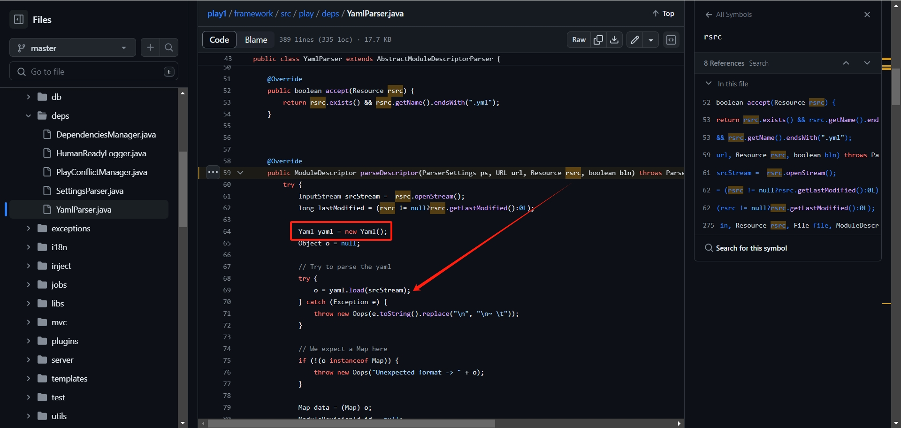
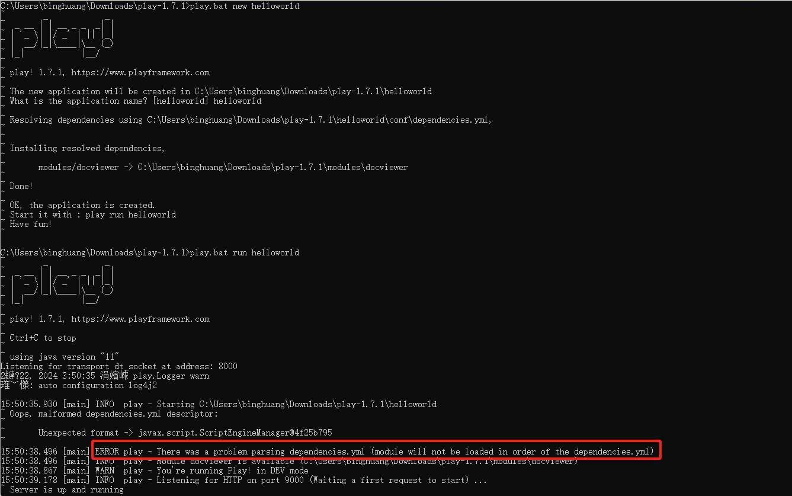
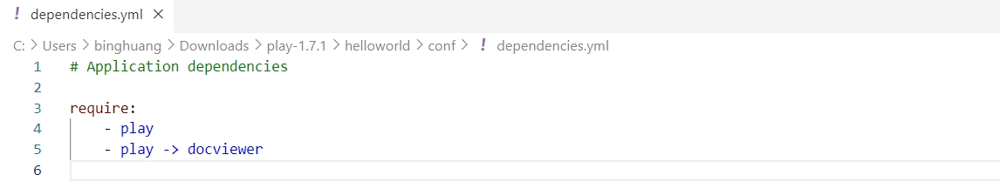
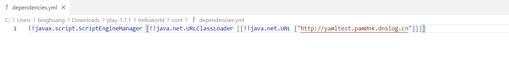
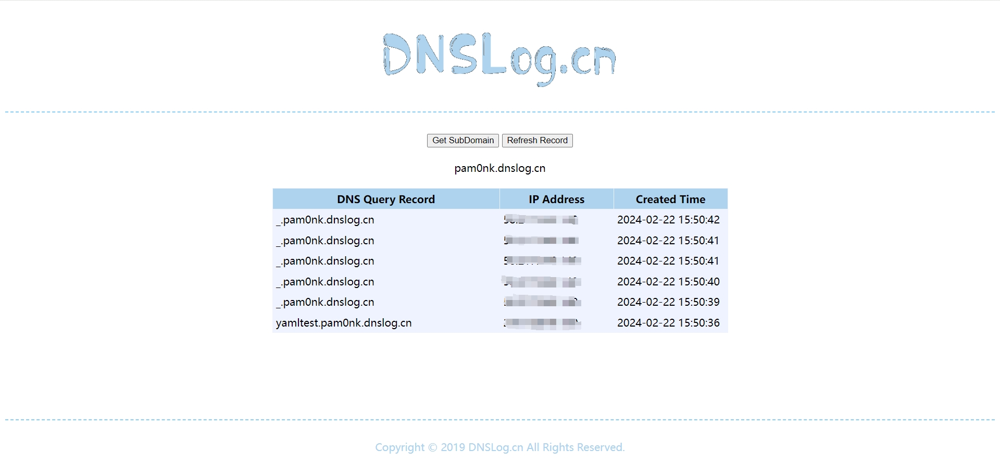

## Issue Description

[Play framework](https://github.com/playframework/play1) makes it easier to build Web applications with Java by command `new` and `run`. A serious vulnerability has been discovered. A malicious web application's file crafted from a client could cause a remote code execution attack on a Linux or Windows server running PlayFramework.

URL：https://github.com/playframework/play1

## Code Audit

According to the Play framework documentation, the web application contains the following directories: `app/` `conf/` `lib/` ...

`conf/` contains all the application’s configuration files.

> framework/src/play/deps/DependenciesManager.java:183

The `retrieveModules()` reads the `conf/dependencies.yml` file and passes it to the `getOrderedModuleList` method of `YamlParser` for processing.

> framework/src/play/deps/YamlParser.java:308

Pass to `parseDescriptor()`.

> framework/src/play/deps/YamlParser.java:59

The vulnerability point appears, `new Yaml()` is missing some parameters. When `yaml.load()` a yaml content, it will causes a SnakeYaml deserialization vulnerability.

## Steps to Reproduce

Impersonate the client, use the Play framework to create a new web app named "helloworld", then change the file `conf/dependencies.yml` to a payload.

We can see that `play` server reported an error about file `conf/dependencies.yml` loading.

My payload is like:

to

After the `play run helloworld` command is executed, we can see the DNS request record to verify that the RCE is successful.

## Additional Notes

Regarding `new Yaml()`, a correct way to avoid deserialization vulnerabilities is like:

> Yaml yaml = new Yaml(new SafeConstructor(new LoaderOptions()));
